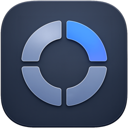

<p align="center">
  
</p>

<h1 align="center">PopDeck</h1>

<p align="center">
  <a href="README.md">English</a> | <a href="README.zh-CN.md">中文</a>
</p>

PopDeck 是一款使用 SwiftUI 和 AppKit 构建的原生 macOS 弹出式启动器。它常驻菜单栏，可以在鼠标指针附近呼出启动面板，用来快速打开常用应用、文件夹、文件和网页链接。

项目目前处于早期开发阶段。当前目标是先做成一个轻量、开源、配置清晰的 macOS 工具，并为后续自动更新能力打好发布基础。

## 预览


## 功能

- 无 Dock 图标的菜单栏应用。
- 全局启动快捷键，可在设置中配置。
- 跟随鼠标位置呼出的启动面板。
- 支持拖动、排序和移除启动项。
- 内置常用应用和文件夹默认项。
- 支持添加自定义应用、文件夹、文件和 URL。
- 支持一键还原默认启动器布局。
- 可选开机自动启动。
- 支持中文和英文界面文本。

## 环境要求

- macOS 14 或更高版本。
- Xcode 16 或更高版本，或对应的 Swift 工具链。

## 从源码运行

```bash
swift run
```

也可以在 Xcode 中将本文件夹作为 Swift package 打开，选择 `PopDeck` executable 后运行。

## 构建 App Bundle

```bash
./scripts/build-app.sh release
```

构建完成后的 app bundle 位于：

```text
.build/PopDeck.app
```

## 创建发布 Zip

```bash
./scripts/package-release.sh
```

发布产物会生成到 `dist/`：

```text
dist/PopDeck-0.1.0.zip
dist/PopDeck-0.1.0.zip.sha256
```

当前发布构建尚未签名。添加 Developer ID 签名和 Apple notarization 之前，用户可能需要在 macOS 隐私与安全性中手动允许打开应用。

## 项目标识

- App 名称：`PopDeck`
- Bundle identifier：`com.tangfanx.popdeck`
- 当前版本：`0.1.0`
- 当前构建号：`1`

## Roadmap

- 使用 GitHub Releases 提供第一批公开下载。
- 接入基于 Sparkle 的自动更新。
- 添加 Developer ID 签名和 Apple notarization。
- 根据实际情况选择 GitHub Releases、Cloudflare R2 或二者共同托管更新 feed 和发布产物。

## License

PopDeck 使用 MIT License 开源。详见 [LICENSE](LICENSE)。
